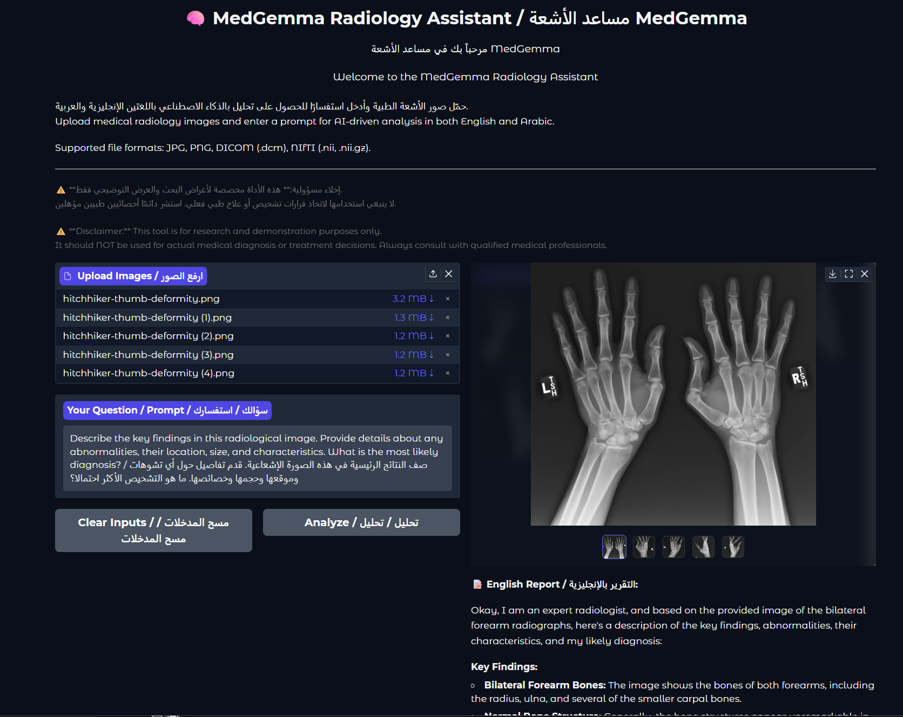

<div align="center">
  <h1>🧠 MedGemma Radiology Assistant / مساعد الأشعة MedGemma 🧠</h1>
  <p>
    An AI-powered medical image analysis tool using Google's MedGemma and Gradio, providing bilingual (English/Arabic) reports.
    <br />
    أداة تحليل صور طبية مدعومة بالذكاء الاصطناعي باستخدام نموذج MedGemma من جوجل و Gradio، تقدم تقارير ثنائية اللغة (إنجليزية/عربية).
  </p>
</div>

<p align="center">
  
</p>

## 🌟 Features / الميزات

-   Upload medical radiology images (JPG, PNG, DICOM, NIfTI).
    *تحميل صور الأشعة الطبية (JPG, PNG, DICOM, NIfTI).*
-   Enter a text prompt to guide the AI's analysis.
    *إدخال استفسار نصي لتوجيه تحليل الذكاء الاصطناعي.*
-   Receive an AI-generated report in English.
    *الحصول على تقرير تم إنشاؤه بواسطة الذكاء الاصطناعي باللغة الإنجليزية.*
-   Automatically get an Arabic translation of the report (chunked for longer texts).
    *الحصول تلقائيًا على ترجمة عربية للتقرير (مقسمة للنصوص الطويلة).*
-   Download the dual-language report as a text file.
    *تحميل التقرير ثنائي اللغة كملف نصي.*

---

## ⚠️ Disclaimer / إخلاء مسؤولية

<div align="center" style="padding: 10px; border: 1px solid #ffcc00; background-color: #fff9e6; border-radius: 5px;">
  <p style="font-size: 1.1em; color: #997a00;">
    <strong>ENGLISH:</strong> This tool is for <strong>research and demonstration purposes ONLY</strong>. It should <strong>NOT</strong> be used for actual medical diagnosis or treatment decisions. Always consult with qualified medical professionals for any health concerns.
  </p>
  <hr style="border-top: 1px dashed #ffcc00; margin: 10px 0;">
  <p style="font-size: 1.1em; color: #997a00; direction: rtl; text-align: right;">
    <strong>بالعربية:</strong> هذه الأداة مخصصة <strong>لأغراض البحث والعرض التوضيحي فقط</strong>. <strong>لا ينبغي</strong> استخدامها لاتخاذ قرارات تشخيص أو علاج طبي فعلي. استشر دائمًا أخصائيين طبيين مؤهلين لأي مخاوف صحية.
  </p>
</div>

---

## 🛠️ Prerequisites / المتطلبات الأساسية

-   Python 3.9+
-   For GPU acceleration (highly recommended for speed):
    -   An NVIDIA GPU with CUDA support.
    -   Up-to-date NVIDIA drivers.
    -   PyTorch installed with CUDA support (see setup instructions).

---

## 🚀 Setup and Installation / الإعداد والتثبيت

Follow these steps to set up the project environment:

1.  **Clone the repository / استنساخ المستودع:**
    ```bash
    git clone https://huggingface.co/google/medgemma-4b-it
    cd medgemma-4b-it
    ```
    *(Replace `YOUR_USERNAME/YOUR_REPOSITORY_NAME` with your actual GitHub path)*

2.  **Create and activate a Python virtual environment / إنشاء وتفعيل بيئة بايثون افتراضية:**

    *   **Using `conda` (Recommended for PyTorch with CUDA):**
        ```bash
        # Create a new Conda environment (e.g., named 'medgemma_env' with Python 3.10)
        conda create --name medgemma_env python=3.10 -y
        conda activate medgemma_env
        ```

    *   **Using `venv` (Python's built-in):**
        ```bash
        # Create a venv (e.g., named 'venv')
        python -m venv venv
        # Activate it:
        # On Windows:
        .\venv\Scripts\activate
        # On macOS/Linux:
        # source venv/bin/activate
        ```

3.  **Install PyTorch with CUDA support / تثبيت PyTorch مع دعم CUDA:**
    This is crucial for GPU acceleration. Visit the [official PyTorch website](https://pytorch.org/get-started/locally/) and select:
    - OS: Your Operating System
    - Package: `Conda` or `Pip` (matching your environment choice above)
    - Language: Python
    - Compute Platform: A CUDA version compatible with your GPU/drivers (e.g., CUDA 11.8 or 12.1).
    
    Then, run the generated installation command from the PyTorch website in your activated environment.
    *Example for **pip** and CUDA 11.8:*
    ```bash
    pip install torch torchvision torchaudio --index-url https://download.pytorch.org/whl/cu118
    ```
    *Example for **conda** and CUDA 11.8:*
    ```bash
    conda install pytorch torchvision torchaudio pytorch-cuda=11.8 -c pytorch -c nvidia
    ```

4.  **Install other dependencies / تثبيت الاعتماديات الأخرى:**
    Once PyTorch is installed and your environment is active:
    ```bash
    pip install -r requirements.txt
    ```
    *(The script will attempt to download NLTK's 'punkt' data on first run if needed. If issues persist, run `python -c "import nltk; nltk.download('punkt')"` in your environment.)*

---

## ▶️ How to Run / كيفية التشغيل

Once the setup is complete, ensure your virtual environment is active, then run:
```bash
python med.py
